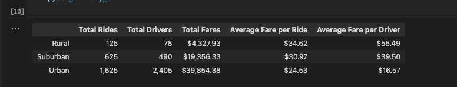
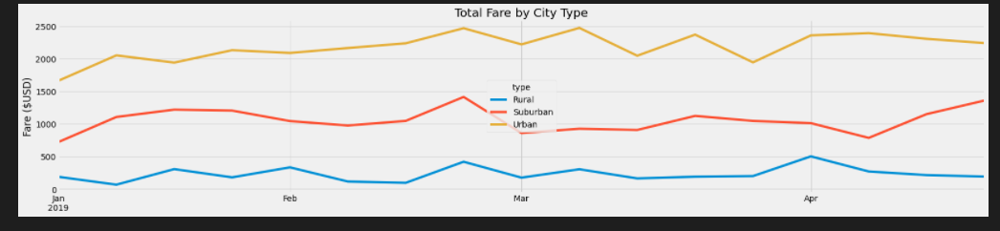

# Module 5 Challenge: PyBer Analysis

## Analysis Overview

- This analysis creates a summary DataFrame of the ride-sharing data organized by city type using Pandas.
    - The city types include Urban, Suburban, and Rural
- Then, using Matplotlib, the analysis includes a multi-line plot depicting the the Fare in U.S. dollars on the y-axis and the month of the year on the x-axis. 
    - Each line corresponds with a different city type. 
    - Format enables comparison of fare amount among the 3 city types.

## Results

- The Summary DataFrame highlights the following differences among the city types:
    - The Rural cities have  the fewest amounts of rides, drivers, and total fares, while having the highest average fares per ride and per driver.
    - In contrast, the the Urban cities have the highest amount of rides, drivers, and total fares with the lowest average fares per ride and per driver.
    - Predictably, the Suburban cities fall between the Rural and Urban cities on all indicators. 
    - The data suggests that there is a correlation between the amount of drivers, total fares, and the average fare costs:
        - Rural cities have 78 drivers with an average fare per ride of $34.62 with total fares of $4,327.93
        - Urban cities have 2,405 drivers with an average fare oer ride of $24.53 with total fares of $39,854.38

- Creating a multi-line plot required creating a new DataFrame organized by city type and date
    - From there, creating a pivot table based on this new DataFrame and isolate the date ranges of January to April 2019
    - Finally, converting this pivot table to a Pandas DataFrame allows for using Matplotlib to create the multi-line plot

- This plot highlights that Urban cities generate the most revenue among the 3 city types even with the lower per ride fare as seen in the Summary DataFrame.

## Summary

- The Summary DataFrame and multi-line plot both indicate that the Rural cities are not adequately served with drivers resulting in burdening customers with higher fare prices and lower revenue for PyBer. 

- Recommendations: 
    1. Recruit more drivers for the Rural and Suburban city types with emphasis on the Rural cities.
    2. Offer higher pay for Rural drivers to better serve Rural cities.
    3. Run campaigns with lower fare prices in Rural and Suburban cities to incentivize more people to use PyBer.
    